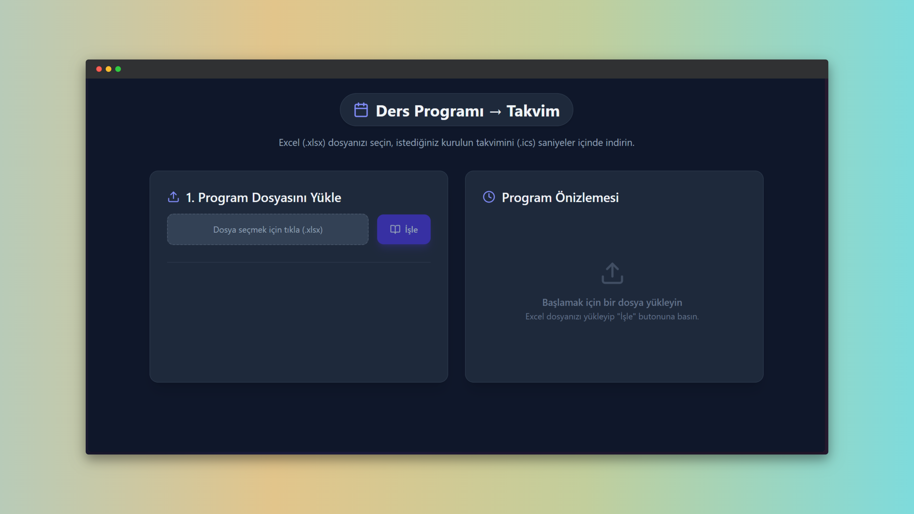

# CVS 📅

  

🎓 **CVS (Course View System)** is a web-based utility designed to bridge the gap between traditional university Excel schedules and modern digital calendars. It parses complex semester schedules and converts them into manageable formats for your phone and smartwatch.

Our goal is to eliminate the manual entry of classes and help students organize their academic life with just a few clicks.

## ✨ Features

- **Excel to Calendar Conversion:** Instantly transforms university-formatted `.xlsx` files into standard `.ics` calendar files.
- **Smart Parsing Logic:**
  - **Auto-Detection:** Automatically identifies dates, times, topics, and instructors based on column headers like "GÜN", "SAAT", and "KONU".
  - **Clean Output:** Filters out lunch breaks ("Öğle Arası") and empty slots automatically.
- **Multi-Sheet Support:** Reads multiple sheets (Kurullar) from a single Excel file and allows you to select which specific term/committee you want to export.
- **Live Preview:** View your parsed schedule in a modern, dark-themed list before downloading.
- **Universal Compatibility:** The generated `.ics` files work seamlessly with **Apple Calendar (iOS/macOS)**, **Google Calendar**, and **Outlook**.

## 🛠️ Usage

Converting your schedule is incredibly simple:

1.  **Upload File:** Click the upload area to select your university schedule (`.xlsx` format).
2.  **Process:** Click the **`İşle`** button to parse the file.
3.  **Select Term:** Choose the specific "Kurul" (Committee/Term) you want to add to your calendar from the tabs provided.
4.  **Review & Download:** Check the preview panel on the right. If everything looks good, click the **`İndir`** button to save the `.ics` file.
5.  **Import:** Open the downloaded file on your phone or computer to add all events to your calendar instantly.

## 💡 Upcoming Features & Enhancements

This project is under continuous development to support more university formats. Here is our roadmap:

- **Drag & Drop Support:** Easier file uploading experience.
- **Direct API Integration:** Sync directly with Google Calendar without downloading a file.
- **Custom Mapping:** Interface to manually map columns if the Excel format differs.
- **Mobile App:** A native wrapper for iOS and Android.
- **English UI Support:** Multi-language support for the user interface.

## 🤝 Contributing

Contributions to this project are welcome! If you want to add support for a different university format or improve the parser, please fork the repository.

1.  Fork the Project.
2.  Create your Feature Branch (`git checkout -b feature/SmartParser`).
3.  Commit your Changes (`git commit -m 'Add support for new column layout'`).
4.  Push to the Branch (`git push origin feature/SmartParser`).
5.  Open a Pull Request.

## 🔧 Tech Stack

This project was brought to life with these amazing technologies:

- **React:** For building the interactive user interface.
- **SheetJS (xlsx):** For robust Excel file parsing and data extraction.
- **Tailwind CSS:** For the modern, responsive, and dark-mode styling.
- **Lucide React:** For beautiful and consistent iconography.

## 📄 License

This project is licensed under the MIT License - see the `LICENSE` file for details.
